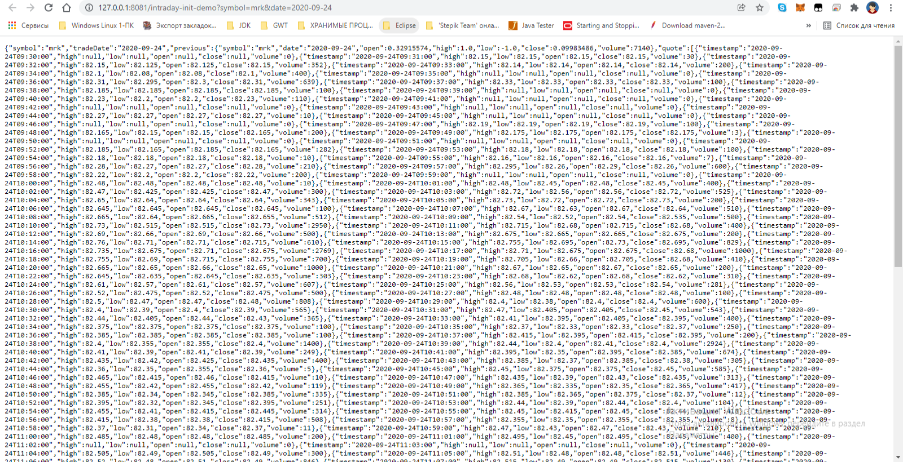
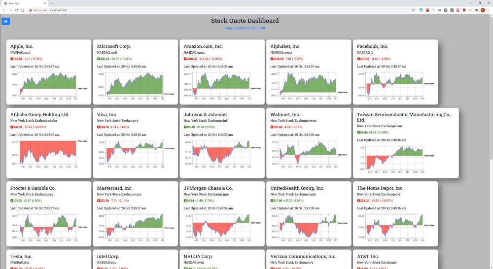

# Stock Quote Dashboard

* [Data provided by IEX Cloud](https://iexcloud.io/)
* [MongoDB Altas](https://cloud.mongodb.com)
  
* http://localhost:3000/
  


(WebFlux Charts Example)
======================

Обычно алгоритм работы HTTP-протокола - это запрос-ответ...

WebFlux - это работа со стримами через HTTP-протокол.

Стримы - это непрерывный поток данных...
Клиент подключается к каналу и получает непрерывный поток данных из сервера.
Каанал через который клиент подключается к серверу (для получения непрерывного потока данных) - это WebSocket.

В Java на backend-е такой WebSocket может быть реализован либо как отдельной библиотекой.
А еще реализация такой библиотеки WebSocket уже входит в ядро Spring-5 - это Spring WebFlux...

* (Kirill Sereda * Reactive Programming: Reactor и Spring WebFlux — часть 1) https://medium.com/@kirill.sereda/reactive-programming-reactor-и-spring-webflux-3f779953ed45
* (Kirill Sereda * Reactive Programming: Reactor и Spring WebFlux — часть 2) https://medium.com/@kirill.sereda/reactive-programming-reactor-и-spring-webflux-часть-2-a0273a5d4ebd
* (Kirill Sereda * Reactive Programming: Reactor и Spring WebFlux — часть 3) https://medium.com/@kirill.sereda/reactive-programming-reactor-и-spring-webflux-часть-3-bcd2419c327b
* (github * ksereda/Spring-WebFlux) https://github.com/ksereda/Spring-WebFlux

На Frontend-е, поддержка работы со стримами имеет разные варианты реализации:
- через ReactJS;
- через Angular;
- через Vue;

* (A HTTP/2 multiplexing demo with Spring WebFlux Netty and React) https://kwonghung-yip.medium.com/a-demo-for-http-2-multiplexing-with-spring-webflux-netty-and-react-9a1a62d8fb61
* (Stock Quote Dashboard - Spring WebFlux Backend) https://github.com/kwonghung-YIP/stock-dashboard-backend
* (Stock Quote Dashboard - React Frontend) https://github.com/kwonghung-YIP/stock-dashboard-frontend


---

* (NPM Trends * react vs vue) https://www.npmtrends.com/@angular/core-vs-angular-vs-ember-source-vs-react-vs-vue
* (vuejs / vue) https://github.com/vuejs/vue


---

[snipboard.io](https://snipboard.io)


---

### Не решенные проблемы в коде

1. Законченна синхронизация базы данных `Mongo` (для коллекции: **intraday-prices**)
   [https://cloud.mongodb.com/](https://cloud.mongodb.com/v2/61aef8f141949f79519dea5c#metrics/replicaSet/61d164ca957e0b75f091c8b8/explorer/stock/intraday-prices/find)
   
   
2. Не законченна синхронизация базы данных `Mongo` (для коллекции: **previous**)
3. После полной синхронизации базы данных `Mongo` Backend-приложение должно возвращать следующий результат:
   1. http://127.0.0.1:8081/intraday-delta-demo?symbol=dis&since=2020-09-24T09:30:00
      
   2. http://127.0.0.1:8081/intraday-init-demo?symbol=mrk&date=2020-09-24
      
4. Дальше данные,поля передаются и затягиваются Frontend-ом
   
   1. Как на оригинале [A HTTP/2 multiplexing demo with Spring WebFlux Netty and React](https://kwonghung-yip.medium.com/a-demo-for-http-2-multiplexing-with-spring-webflux-netty-and-react-9a1a62d8fb61)
      
5. Требуется на Frontend-е:
   
   1. обновить следующие библиотеки `Browserslist: caniuse-lite is outdated.` https://github.com/browserslist/browserslist#browsers-data-updating
      ```text
      npx browserslist@latest --update-db

      Why you should do it regularly:
      https://github.com/browserslist/browserslist#browsers-data-updating
      ```
   2. обновить следующие библиотеки `React Native Elements (3.4.2)`
      1. https://reactnativeelements.com/docs/3.4.2/getting_started
      2. [React Native Elements on Create React App](https://github.com/react-native-elements/create-react-app-example) **(** https://github.com/react-native-elements/create-react-app-example/blob/master/public/manifest.json **)**
   3. теряются параметры ( **useEffect** ) передаваемые из Backend-а:
      ```text
      ./src/components/StockCard.jsx
      Line 58:7:   React Hook useEffect has missing dependencies: 'apiHost' and 'symbol'. Either include them or remove the dependency array                       react-hooks/exhaustive-deps
      Line 69:7:   React Hook useEffect has missing dependencies: 'apiHost', 'config.tradeDate', and 'symbol'. Either include them or remove the dependency array  react-hooks/exhaustive-deps
      Line 77:7:   React Hook useEffect has missing dependencies: 'apiHost', 'config.tradeDate', and 'symbol'. Either include them or remove the dependency array  react-hooks/exhaustive-deps
      Line 105:7:  React Hook useEffect has missing dependencies: 'apiHost', 'config.tradeDate', and 'symbol'. Either include them or remove the dependency array  react-hooks/exhaustive-deps

      Search for the keywords to learn more about each warning.
      To ignore, add // eslint-disable-next-line to the line before.
      ```
   4. Отсутствуют иконки/картинки которые передаются в файл `stock-dashboard-frontend/public/manifest.json` и `stock-dashboard-frontend/public/index.html`
      
      
   5. Документацию про адаптивные иконки ( **Progressive Web Apps** ) можно найти здесь
      1. https://web.dev/maskable-icon/?utm_source=devtools
      2. https://maskable.app/editor
   6. Документацию про файл-Manifest ( **Web App Manifest** ) можно найти здесь
      1. https://developer.mozilla.org/ru/docs/Web/Manifest
      2. https://web.dev/add-manifest/
   7. И JS-библиотека которая визуализирует `чарты` ( **< Recharts />** ) можно найти здесь
      1.  https://recharts.org/en-US
   8. 
7. 