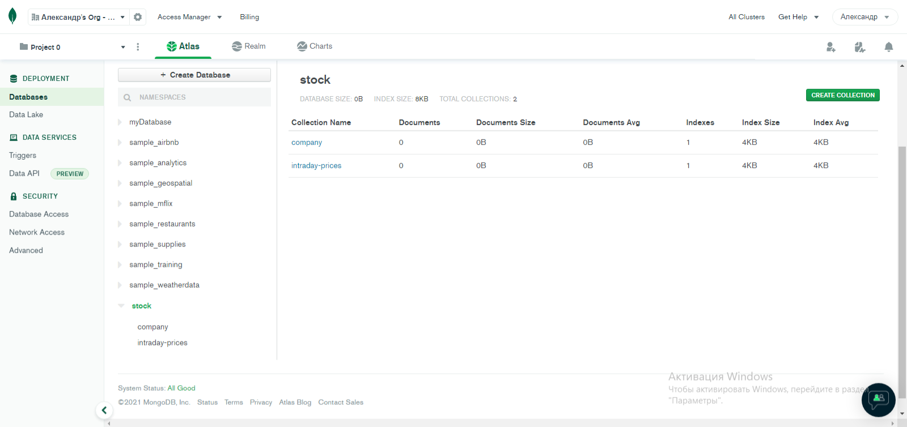
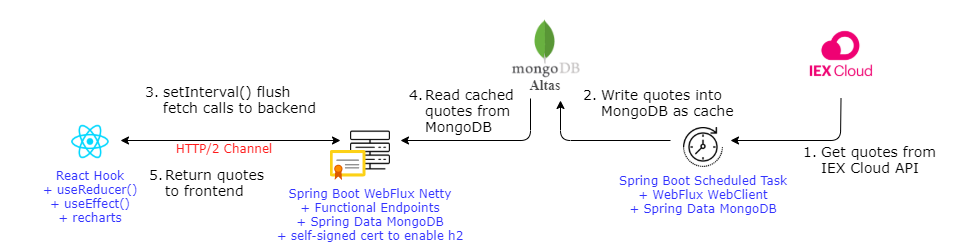
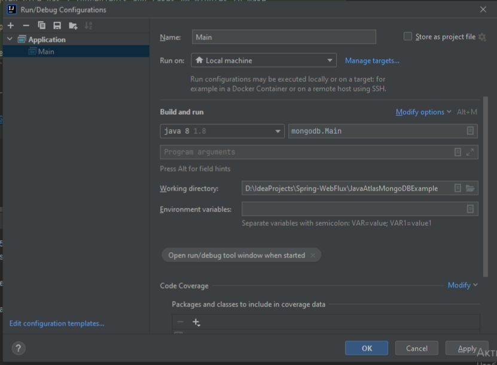
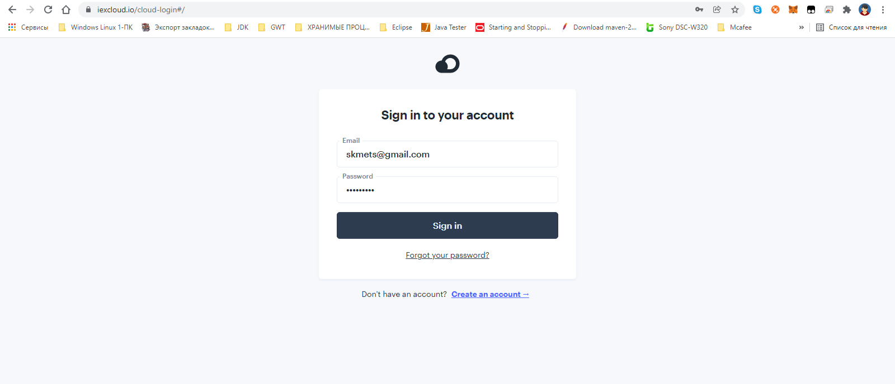
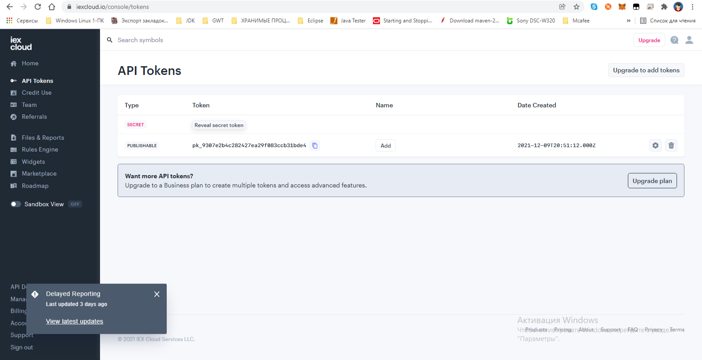

# Панель управления котировками акций (Spring WebFlux Backend)

* `Tutorial`: https://kwonghung-yip.medium.com/a-demo-for-http-2-multiplexing-with-spring-webflux-netty-and-react-9a1a62d8fb61
* `IEX cloud API`: https://iexcloud.io/docs/api/#data-format
* `Atlas MongoDB` + `Cluster0` + `stock.previous`: https://cloud.mongodb.com
  
* `MongoDB's Best Practices`: https://github.com/lakshmantgld/mongoDB-Atlas
* `MongoDB Atlas Documentation`: https://docs.atlas.mongodb.com/security/ip-access-list/
  ```text
    IMPORTANT
    Adding the CIDR 0.0.0.0/0 allows access from anywhere. Ensure that strong credentials (username and password) are used for all database users when allowing access from anywhere.
  ```
* `MongoDB Developer Community`: https://www.mongodb.com/community/forums/t/cannot-insert-all-documents-to-the-mongodb-cloud-cluster-prematurely-reached-end-of-stream/1161
  ```text
  Cannot insert all documents to the MongoDB cloud cluster: Prematurely reached end of stream
  I’m using JDK/JRE version like: 1.8.0_192
  When I’m inserting documents to the Mongodb cloud cluster, I’m getting always the issue:
  ```
* **(** Discovered replica set primary: `cluster0-shard-00-02.h3xur.mongodb.net:27017` **)**
* **(** Netty started on port(s): `8081` **)**

Stock Quote Dashboard - это end-to-end демонстрация того как повысить пропускную способность сети между браузером и серверной частью REST API с использованием протокола HTTP/2.

[Это репозитрий](https://github.com/kwonghung-YIP/stock-dashboard-frontend) - сервернвя часть реализована с помощью `Spring WebFlux`, а для части интерфейса используется `React`.


Для обзора панели управления котировками акций посетите [my medium post](https://kwonghung-yip.medium.com/a-demo-for-http-2-multiplexing-with-spring-webflux-netty-and-react-9a1a62d8fb61?sk=eda397c3fcd1a8dd39597bbcb863de71).



This repo contains 4 maven sub-modules
1. **datafeed-scheduler** - задание по расписанию для получения рыночных данных из IEX Cloud API и записи их в MongoDB Altas в качестве кеша.
2. **quote-webflux-api** - встроенный сервер Netty для запроса кеша рыночных данных в MongoDB Atlas.
3. (**core-domain-library**) - pojo и другая общая библиотека для совместного использования обоими вышеуказанными модулями
4. (**iexcloud-api-wrapper**) - клиентская оболочка REST API для IEX Cloud API

## Run quote-webflux-api backend

1. Java 1.8

* The java version this course is built against is Java 1.8. You can download
  


---

* `IEX Cloud API`: https://itgap.ru/post/api-dlya-fondovogo-rynka
  ```text
  упрощает создание и масштабирование финансовых продуктов, поскольку предоставляет простые способы получения и использования точных рыночных данных.
  Предоставьте своим разработчикам доступ к данным на уровне учреждений, в том числе в режиме реального времени, основам, международным акциям, собственности, взаимным фондам и другим данным.
  
  Вы получаете полное покрытие на рынке США с более чем 95 000 ценных бумаг, более 100 валют и более 20 бирж.
  Он позволяет получить доступ к данным в кратчайшие сроки, поэтому вы можете сосредоточиться на создании API с безупречными функциями, полезными для ваших пользователей.
  ```
* `IEX API Introduction Guide`: https://algotrading101.com/learn/iex-api-guide/
1. `Регистрация (для разработчика)`: https://iexcloud.io/
   * https://mail.google.com/mail/u/0/?tab=rm&ogbl#inbox/FMfcgzGllMNdBdRFTXkclnZwCqdgsbbh
   * ( https://mail.google.com/mail/u/0/?tab=rm&ogbl#inbox/FMfcgzGllMNdBfWwrrRkhhFnlQdpKWhM )
   
2. `Получение токена (бесплатно)`: API Tokens
   * https://iexcloud.io/console/
   * https://iexcloud.io/console/tokens
     
3. `IEX Cloud Introduction|Guides|...`: https://iexcloud.io/docs/api/
   * https://cloud.iexapis.com/stable/stock/aapl/quote?token=<API_TOKEN>
   * https://cloud.iexapis.com/stable/stock/aapl/chart?token=<API_TOKEN>
   * https://cloud.iexapis.com/stable/stock/aapl/chart?token=<API_TOKEN>&chartByDay=true&exactDate=20200924
4. Запускаем серверный модуль **datafeed-scheduler** (`DatafeedSchedulerApplication`) чтобы синхронизировать данные и загрузить их из веб-сервиса `IEX API` в базу данных `Atlas MongoDB`
5. Запускаем серверный модуль **quote-webflux-api** (`QuoteWebfluxApiApplication`) чтобы вернуть данные для клиентского модуля 
6. Запускаем клиентский модуль **stock-dashboard-frontend** чтобы продемонстрировать вывод данных в графическом режиме (Charts)


---

Перед запуском spring boot проекта сначала вы должны указать ваш логин Altas MongoDB.

```yaml
mongodb-altas:
  login: <your-mongodb-altas-login>
  passwd: <your-mongodb-altas-password>
  cluster-domain: <your-mongodb-altas-domain>
```
## Run datafeed-scheduler to get market data

Before start the spring boot project, first you have to define following properties to specify your IEX API token and altas login.

```yaml
iex-cloud:
  base-url: https://cloud.iexapis.com/stable/
  api-token: <your iex cloud token>
  
mongodb-altas:
  login: <your-mongodb-altas-login>
  passwd: <your-mongodb-altas-password>
  cluster-domain: <your-mongodb-altas-domain>
```
