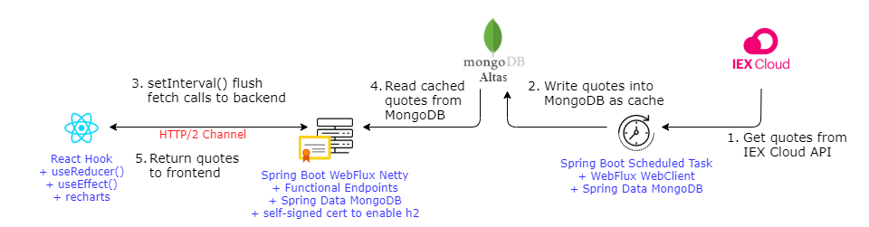

# Панель управления котировками акций (React Frontend)

Stock Quote Dashboard - это end-to-end демонстрация того как повысить пропускную способность сети между браузером и серверной частью REST API с использованием протокола HTTP/2.
* **(** react-scripts start on port(s): `3000` **)**

[Это репозиторий](https://github.com/kwonghung-YIP/stock-dashboard-backend) - является реализацией внешнего интерфейса с помощью `React`, а для серверной части используется `Spring WebFlux`.

Для обзора панели управления котировками акций посетите https://kwonghung-yip.medium.com/a-demo-for-http-2-multiplexing-with-spring-webflux-netty-and-react-9a1a62d8fb61?sk=eda397c3fcd1a8dd39597bbcb863de71



[Docs: React Native Elements (3.4.2)](https://reactnativeelements.com/docs/3.4.2/getting_started)

Is plotted by the **Rechart Area Chart**: https://recharts.org/en-US


http://127.0.0.1:8081/company?symbol=aapl


#Run the React frontend

* Install Node.js server to your local.
* Since the Netty backend default use a self-signed cert for HTTPS, your browser has to trust it or the React frontend cannot fetch the data from backend.
* Run the following to launch the node.js server.

```bash
git clone https://github.com/kwonghung-YIP/stock-dashboard-frontend.git
cd stock-dashboard-frontend
npm install
HTTPS=true npm start
```
